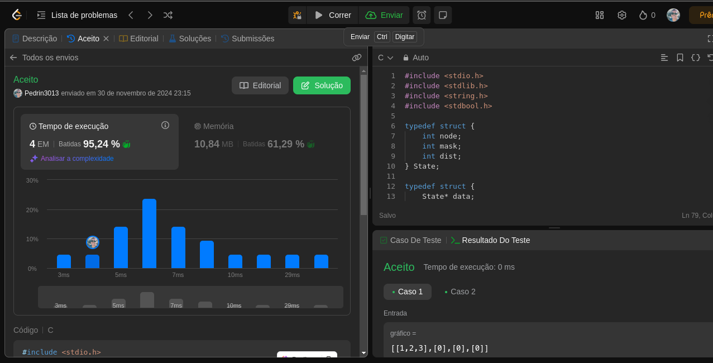

# Grafos2_QuestoesLeetCode

**Número da Lista**: 53 
**Conteúdo da Disciplina**: GRAFOS 2 

## Alunos
|Matrícula | Aluno |
| -- | -- |
| 22/1008688  |  Pedro Paulo Santos Almeida |
| 18/0108875  |  Rodrigo Mattos de Figueiredo Ayres Bezerra |

## Sobre 
O nosso é um projeto de questões do juíz online leetCode, que é um ambiente onde fornece questões de diversos tipos como do mais fácil ao mais difícil para uma boa compreensão sobre os gráfos. Todas as questões estão disṕníveis para qualquer pessoa que deseja ver. 

## Screenshots

**Questão 802**

**Questão 1568**

**Questão 847**

**Questão 1489**

**Questão 2642**

**Questão 1514**

## Instalação 
**Linguagens**: 
- C 
- Python 

## Uso 
Para usar, deve-se entrar no site do [leetCode](https://leetcode.com/), pesquisar a questão na aba de perguntas e copiar a solução indica e testar no local apropriado no site.

## Vídeo 
Os vídeos da entrega explicando o trabalho estão aqui abaixo. No primeiro vídeo é a explicação de como rodar o algoritmo das questões usando o C na plataforma e no segundo vídeo, como rodar o algoritmo das questões usando Python. Toque abaixo para acessar.

- [Entrega_02 - Parte 1](https://unbbr-my.sharepoint.com/:v:/g/personal/221008688_aluno_unb_br/EWJeqIaAUfJEiZMoseTY28MBID9nD_UkdHrEWuGA5987dQ?nav=eyJyZWZlcnJhbEluZm8iOnsicmVmZXJyYWxBcHAiOiJTdHJlYW1XZWJBcHAiLCJyZWZlcnJhbFZpZXciOiJTaGFyZURpYWxvZy1MaW5rIiwicmVmZXJyYWxBcHBQbGF0Zm9ybSI6IldlYiIsInJlZmVycmFsTW9kZSI6InZpZXcifX0%3D&e=kz1JVk)
- [Entrega 02 - Parte 2](https://unbbr-my.sharepoint.com/:v:/g/personal/180108875_aluno_unb_br/EXhDm9Cd3PNDlkolJACFHMABDGasaG_1xVC_6_77x7Ovsg?referrer=Teams.TEAMS-WEB&referrerScenario=MeetingChicletGetLink.view)
  
## Outros 
| N° Questão | Descrição questão | Dificuldade |
| --- | ------- | ---------- |
| 802 | [Find Eventual Safe States](https://leetcode.com/problems/find-eventual-safe-states/)  |   Média |
| 1568  | [Minimum Number of Days to Disconnect Island](https://leetcode.com/problems/minimum-number-of-days-to-disconnect-island/)   |   Difícil      |
| 847 |  [Shortest Path Visiting All Nodes](https://leetcode.com/problems/shortest-path-visiting-all-nodes/)   |   Difícil      |
| 1489    | [Find Critical and Pseudo-Critical Edges in Minimim Spanning Tree](https://leetcode.com/problems/find-critical-and-pseudo-critical-edges-in-minimum-spanning-tree/)  |  Difícil     |
| 2642   | [Design Graph With Shortest Path Calculator](https://leetcode.com/problems/design-graph-with-shortest-path-calculator/)  |   Difícil      |
| 1514  | [Path with Maximum Probality](https://leetcode.com/problems/path-with-maximum-probability/)  |  Média    |
